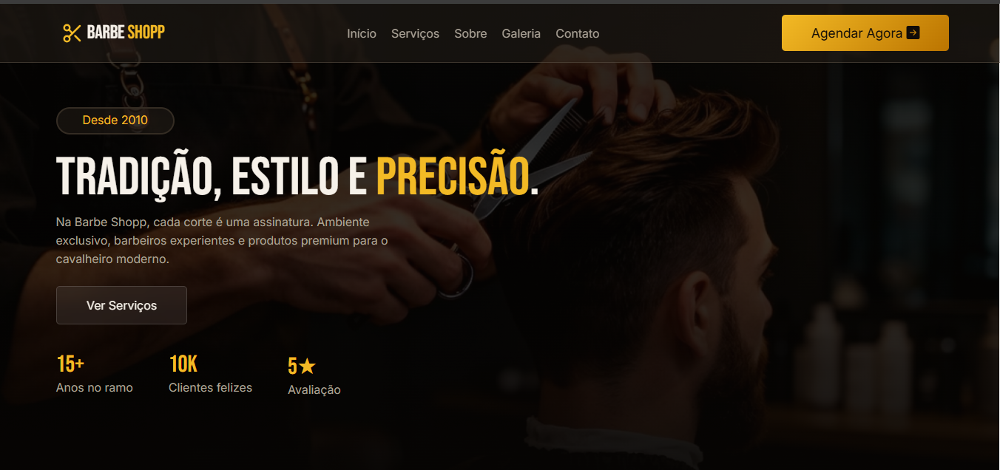
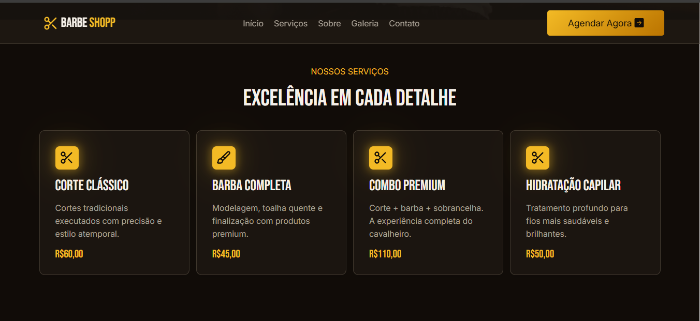
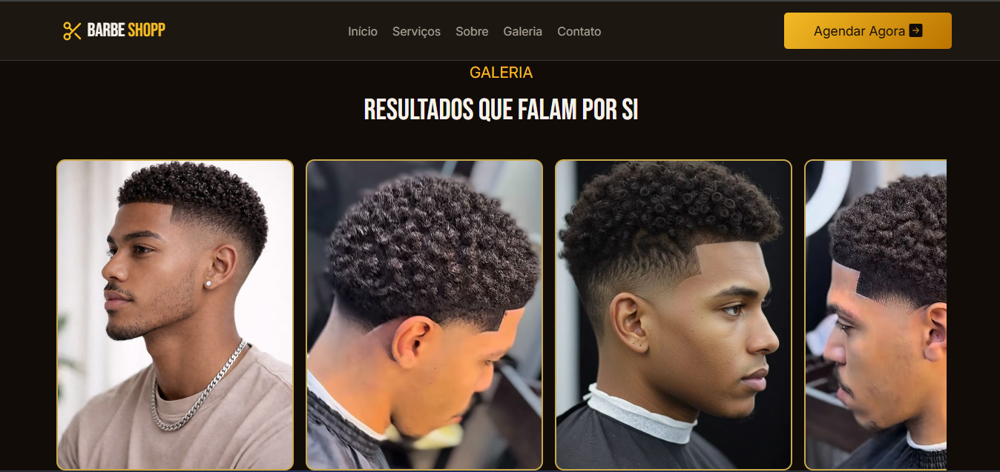

<div align="center">


# Barbe Shopp

**Site institucional de barbearia com agendamento via WhatsApp**

[](https://developer.mozilla.org/pt-BR/docs/Web/HTML)
[](https://developer.mozilla.org/pt-BR/docs/Web/CSS)
[](https://developer.mozilla.org/pt-BR/docs/Web/JavaScript)
[](https://icons.getbootstrap.com/)


[Demonstração](#) · [Reportar Bug](#) · [Sugerir Feature](#)

</div>

---

## 📋 Índice

- [Sobre o Projeto](#-sobre-o-projeto)
- [Funcionalidades](#-funcionalidades)
- [Layout e Seções](#-layout-e-seções)
- [Tecnologias](#-tecnologias)
- [Estrutura de Pastas](#-estrutura-de-pastas)
- [Como Executar](#-como-executar)
- [Personalização](#-personalização)
- [Responsividade](#-responsividade)
- [Autor](#-autor)

---

## 💈 Sobre o Projeto

A **Barbe Shopp** é um site institucional moderno e elegante desenvolvido para barbearias que buscam presença digital profissional. O projeto une design sofisticado com funcionalidades práticas, permitindo que clientes conheçam os serviços e realizem agendamentos diretamente pelo WhatsApp, sem necessidade de back-end ou banco de dados.

O site foi pensado para transmitir a identidade de uma barbearia premium: ambiente acolhedor, serviços de qualidade e atendimento personalizado.





## ✨ Funcionalidades

- ✅ **Navegação fixa** com menu responsivo (desktop e mobile)
- ✅ **Hero section** com imagem de fundo, estatísticas animadas e chamada para ação
- ✅ **Contador animado** de anos de experiência, clientes e avaliação
- ✅ **Cards de serviços** com preços e efeito hover
- ✅ **Seção Sobre** com imagem de ambiente e diferenciais da barbearia
- ✅ **Galeria interativa** com carrossel drag-to-scroll (mouse e touch)
- ✅ **Formulário de agendamento** com validação e envio via WhatsApp
- ✅ **Alertas personalizados** via SweetAlert2 (validação, horário de almoço, sucesso)
- ✅ **Menu mobile** com abertura/fechamento suave
- ✅ **Botão scroll-to-top** no rodapé
- ✅ **Footer completo** com navegação, horários e redes sociais

---

## 🗂 Layout e Seções

| Seção | Descrição |
|---|---|
| **Header / Hero** | Navegação fixa + banner com fundo escurecido e estatísticas |
| **Serviços** | 4 cards com ícone, descrição e preço de cada serviço |
| **Sobre** | Foto do ambiente + texto institucional + diferenciais |
| **Galeria** | Carrossel horizontal com 9 fotos, suporte a drag e touch |
| **Agendamento** | Formulário com validação e integração com WhatsApp |
| **Footer** | Logo, navegação, horários de funcionamento e redes sociais |

---

## 🛠 Tecnologias

### Core
- **HTML5** — Estrutura semântica e acessível
- **CSS3** — Estilização com variáveis CSS, flexbox e media queries
- **JavaScript (Vanilla)** — Interatividade sem dependências pesadas

### Bibliotecas Externas (CDN)
| Biblioteca | Versão | Uso |
|---|---|---|
| [SweetAlert2](https://sweetalert2.github.io/) | 11 | Modais de alerta personalizados |
| [Bootstrap Icons](https://icons.getbootstrap.com/) | 1.13.1 | Ícones vetoriais |

### Fontes (Google Fonts)
- **Bebas Neue** — Títulos e elementos de destaque
- **Inter** — Textos e parágrafos

---

## 📁 Estrutura de Pastas

```
barbe-shopp/
│
├── index.html                  # Página principal
│
└── assets/
    ├── css/
    │   ├── style.css           # Estilos principais
    │   ├── resete.css          # Reset CSS
    │   ├── frame.css           # Variáveis de cor
    │   ├── media.css           # Media queries (responsividade)
    │   └── color.css           # Paleta de cores (variáveis CSS)
    │
    ├── js/
    │   ├── menu.js             # Abertura/fechamento do menu mobile
    │   ├── contador.js         # Animação dos contadores (anos, clientes, avaliação)
    │   ├── carousel.js         # Lógica de drag do carrossel da galeria
    │   └── agendamento.js      # Validação do formulário + envio via WhatsApp
    │
    └── img/
        ├── SVG.svg             # Logo da barbearia
        ├── banner-image.png    # Imagem do hero
        ├── Interior da Barbe Shopp.png  # Foto da seção Sobre
        ├── icon-scissors.svg   # Ícone de serviços
        ├── icon-brush.svg      # Ícone de serviços
        ├── icon-shine.svg      # Ícone de diferenciais
        ├── menu.png            # Ícone hamburguer mobile
        ├── close.png           # Ícone fechar menu mobile
        └── cliente[1-9].jpg    # Fotos da galeria
```

---

## 🚀 Como Executar

Este projeto é 100% estático, sem necessidade de servidor, build ou instalação de dependências.

### Método 1 — Abrir diretamente
```bash
# Clone o repositório
git clone https://github.com/seu-usuario/barbe-shopp.git

# Acesse a pasta
cd barbe-shopp

# Abra o arquivo no navegador
start index.html       # Windows
open index.html        # macOS
xdg-open index.html    # Linux
```

### Método 2 — Live Server (recomendado para desenvolvimento)
1. Instale a extensão **Live Server** no VS Code
2. Clique com o botão direito em `index.html`
3. Selecione **"Open with Live Server"**

---

## 🎨 Personalização

### Alterar número do WhatsApp
No arquivo `assets/js/agendamento.js`, localize e edite:
```javascript
const numeroWhatsApp = '5511987654321'; // DDD + número sem espaços ou símbolos
```

### Alterar informações de contato
No `index.html`, seção `#form-contact`, edite os dados dentro das divs `.coreShell`:
```html
<p>(11) 98765-4321</p>
<p>contato@barbeshopp.com</p>
<p>Rua Tiradentes, 178 — Vila Madalena, SP</p>
```

### Alterar paleta de cores
Edite o arquivo `assets/css/color.css` (ou `frame.css`) onde estão definidas as variáveis CSS:
```css
:root {
  --color-two: #c9a84c; /* Dourado — cor de destaque principal */
  ...
}
```

### Adicionar/remover serviços
Copie ou remova um bloco `.card-servicos` dentro da seção `#top-servicos` no `index.html`.

### Adicionar fotos à galeria
Adicione imagens na pasta `assets/img/` e inclua novos itens no carrossel:
```html
<div style="background-image:url('./assets/img/sua-foto.jpg');" class="carousel-item"></div>
```

---

## 📱 Responsividade

O site é totalmente responsivo, adaptado para diferentes tamanhos de tela via `assets/css/media.css`.

| Dispositivo | Breakpoint | Comportamento |
|---|---|---|
| Desktop | > 1024px | Menu horizontal, layout em colunas |
| Tablet | 768px – 1024px | Ajustes de espaçamento e grid |
| Mobile | < 768px | Menu hamburguer, layout em coluna única |

O carrossel da galeria suporta **drag com mouse** (desktop) e **touch/swipe** (mobile) nativamente.

---

## 👤 Autor

Desenvolvido por **Dev Souza**

---

<div align="center">

© 2026 Barbe Shopp · Todos os direitos reservados

</div>
